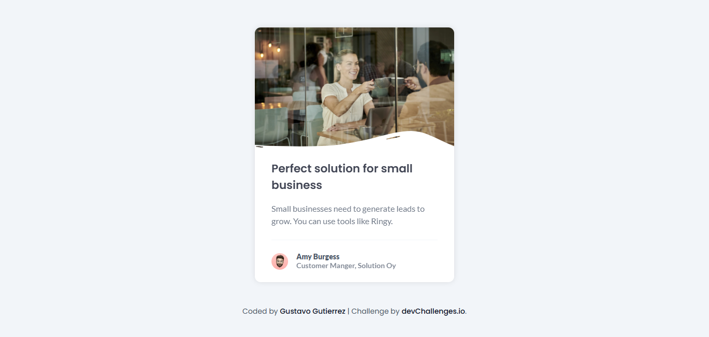

<!-- Please update value in the {}  -->

<h1 align="center">Business Blog Card | devChallenges</h1>

   Solution for a challenge <a href="https://devchallenges.io/challenge/business-blog-card" target="_blank">Business Blog Card</a> from <a href="http://devchallenges.io" target="_blank">devChallenges.io</a>.

  <h3>
    <a href="https://gustavo2023.github.io/business-blog-card/">
      Demo
    </a>
     | 
    <a href="{https://your-url-to-the-solution}">
      Solution
    </a>
     | 
    <a href="https://devchallenges.io/challenge/business-blog-card">
      Challenge
    </a>
  </h3>

<!-- TABLE OF CONTENTS -->

## Table of Contents

- [Overview](#overview)
  - [What I learned](#what-i-learned)
- [Built with](#built-with)
- [Features](#features)

<!-- OVERVIEW -->

## Overview

### What I learned

- **Relative Positioning**: Used to position elements relative to their normal position. In the project, `.top-container` uses `position: relative`; to serve as a reference point for absolutely positioned children.
- **Absolute Positioning**: Positions elements relative to their nearest positioned ancestor. The `.overlay-container` uses `position: absolute`; to be placed within the `.top-container`.
- **Combining Positioning and Flexbox**: Combining `position: absolute`; with flexbox can create dynamic and responsive layouts. For example, the `.overlay-container` is absolutely positioned within a flexbox container.

### Built with

- Semantic HTML5 markup
- CSS custom properties
- Flexbox

## Features

Simple business blog card component built using HTML and CSS.

This application/site was created as a submission to a [DevChallenges](https://devchallenges.io/challenges-dashboard) challenge.

## Author

- GitHub [@gustavo2023](https://github.com/gustavo2023)
